# System Diagrams — Shared AI Interface Backend

> All diagrams rendered in Mermaid. Paste into any Mermaid-compatible renderer
> (GitHub, mermaid.live, VS Code Mermaid Preview extension).

---

## 1. System Architecture Diagram

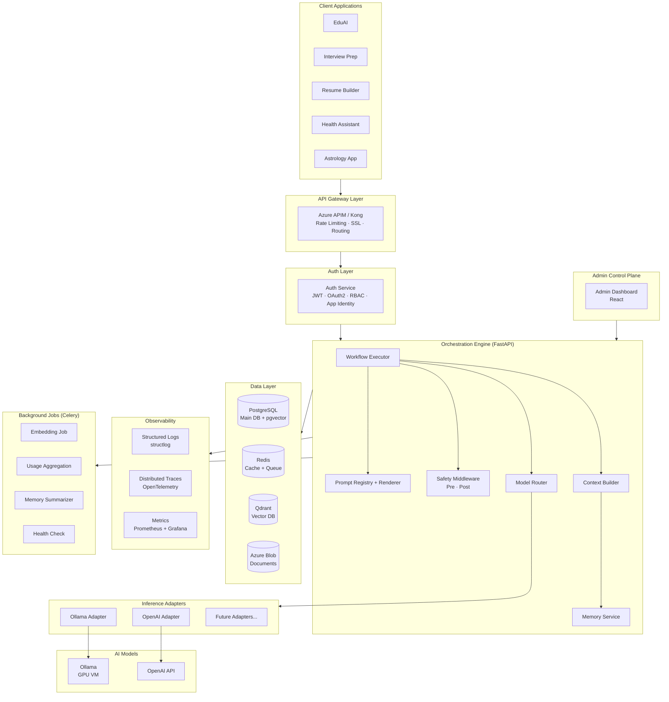

---

## 2. Request Flow Diagram

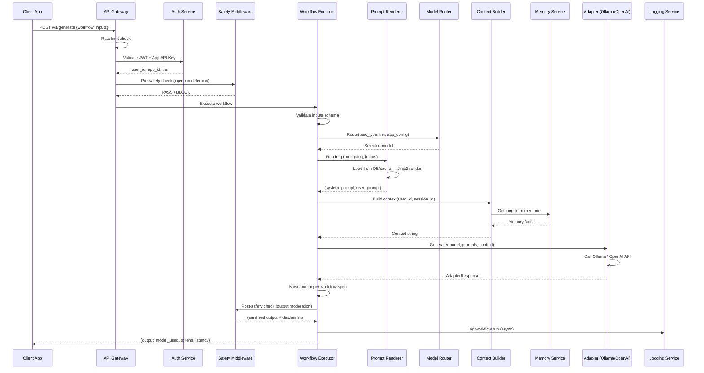

---

## 3. Model Routing Flow

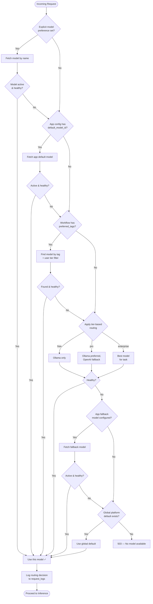

---

## 4. RAG Pipeline Flow

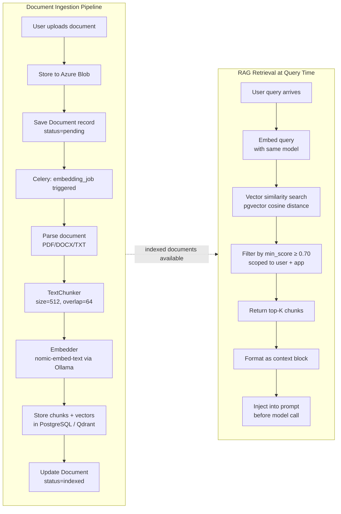

---

## 5. Prompt Management Flow

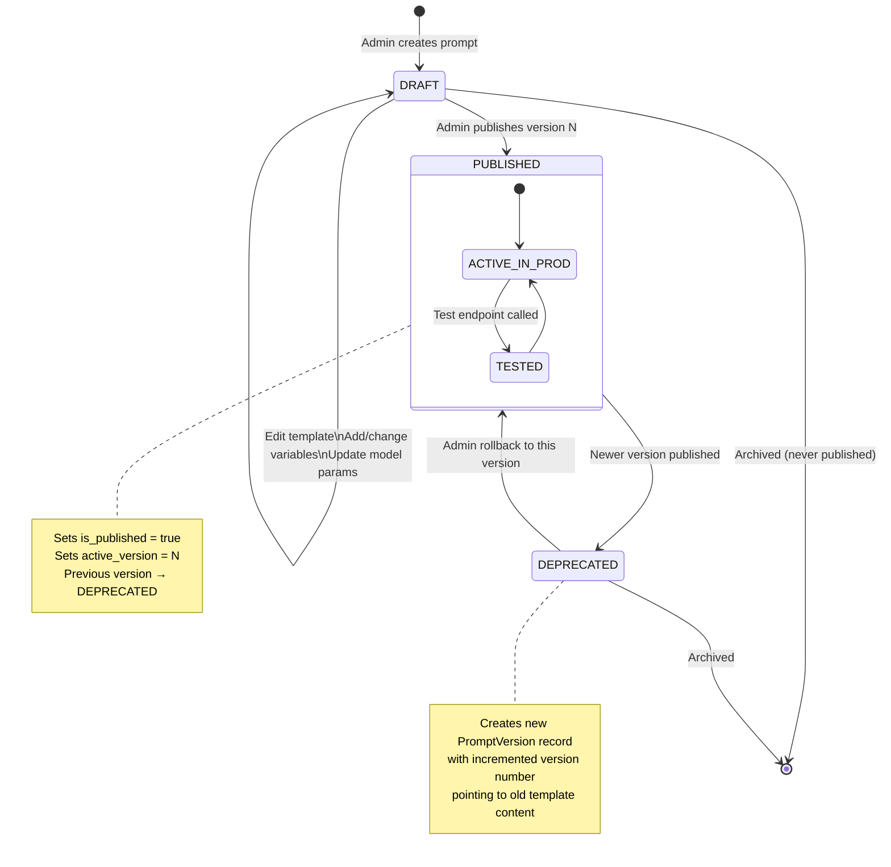

---

## 6. Prompt Resolution Flow (Per-Request)

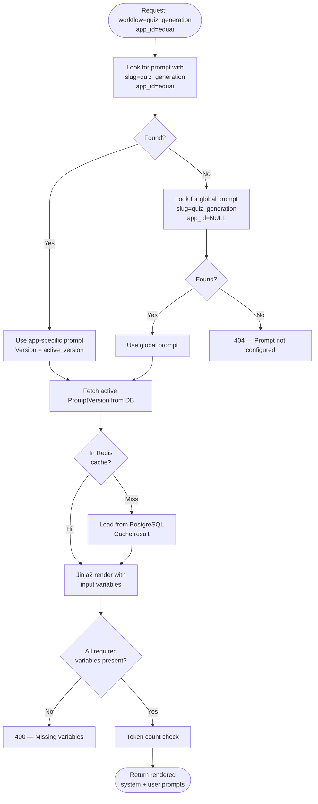

---

## 7. User Memory Flow

```mermaid
flowchart TB
    subgraph WRITE["Memory Write Path (after response)"]
        direction LR
        RESP[Model response received] --> BGEX[Background task triggered]
        BGEX --> ANLY[Analyze conversation for\nmemorable facts\nvia LLM extraction prompt]
        ANLY --> EXT{Facts\nextracted?}
        EXT -->|Yes| UPSRT[Upsert to user_memory table\nkey=fact_name, value=fact_value\nsource=inferred]
        EXT -->|No| SKIP[Skip]
    end

    subgraph READ["Memory Read Path (before request)"]
        direction LR
        REQ2[New request arrives] --> MQ[Query user_memory\nWHERE user_id=X\nAND app_id IN X, NULL\nORDER BY last_accessed DESC\nLIMIT 8]
        MQ --> FMT[Format as context block]
        FMT --> INJ2[Inject into system prompt\nas Known facts about user]
    end

    subgraph COMPRESS["Session Summarization"]
        direction LR
        SESS[Session exceeds\n20 messages or 4000 tokens] --> SUMJ[Celery: memory_summarize_job]
        SUMJ --> SUMR[LLM call with\nsummarization prompt]
        SUMR --> SAVS[Save to sessions.context_summary]
        SAVS --> CLRD[Clear Redis session messages\nkeep last 5]
    end

    subgraph TIERS["Memory Tiers"]
        L1["L1: Request-scope context\n(in-flight, RAM only)"]
        L2["L2: Short-term session\n(Redis, TTL 2h)\nLast N messages"]
        L3["L3: App-specific memory\n(PostgreSQL)\nUser prefs per app"]
        L4["L4: Cross-app memory\n(PostgreSQL)\nName, goals, learning style"]
    end

    L4 --> L3 --> L2 --> L1
```

---

## 8. Safety Pipeline Flow

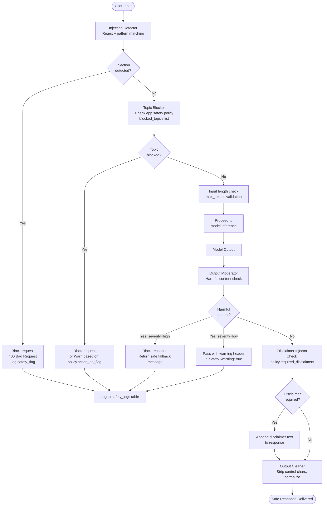

---

## 9. Azure Deployment Architecture

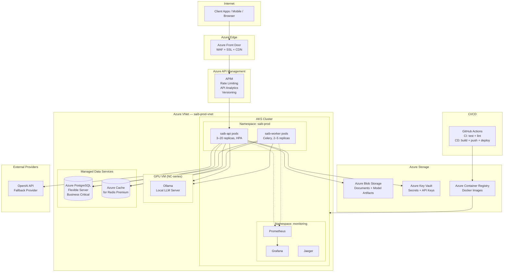

---

## 10. CI/CD Pipeline Flow

```mermaid
flowchart LR
    DEV[Developer pushes\nto feature branch] --> PR[Pull Request opened]
    PR --> CI{GitHub Actions\nCI Workflow}
    CI --> LINT[ruff lint + mypy]
    LINT --> TEST[pytest — unit + integration]
    TEST --> COV{Coverage\n≥ 80%?}
    COV -->|No| FAIL[PR blocked]
    COV -->|Yes| REVIEW[Code Review]
    REVIEW --> MERGE[Merge to main]
    MERGE --> CD[GitHub Actions\nCD Workflow]
    CD --> BUILD[docker build\nmulti-stage]
    BUILD --> PUSH[Push image to\nAzure Container Registry\ntagged with git SHA]
    PUSH --> DEPLOY_DEV[Deploy to DEV\nAzure App Service]
    DEPLOY_DEV --> SMOKE[Smoke tests\nPOST /health]
    SMOKE -->|Pass| DEPLOY_QA[Deploy to QA]
    SMOKE -->|Fail| ROLLBACK[Rollback to\nprevious image]
    DEPLOY_QA --> APPROVAL{Manual\napproval}
    APPROVAL -->|Approved| DEPLOY_PROD[Deploy to PROD\nAKS rolling update]
    APPROVAL -->|Rejected| HOLD[Hold for investigation]
    DEPLOY_PROD --> MONITOR[Monitor dashboards\n15 minutes]
    MONITOR -->|Healthy| DONE([Release complete])
    MONITOR -->|Alerts triggered| RBPROD[AKS rollback\nto previous revision]
```

---

## 11. Multi-App Request Isolation

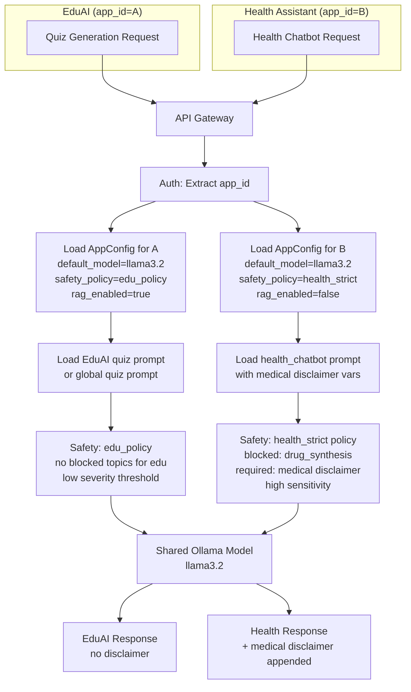

---

## 12. Data Flow — End to End (Chat with Memory + RAG)

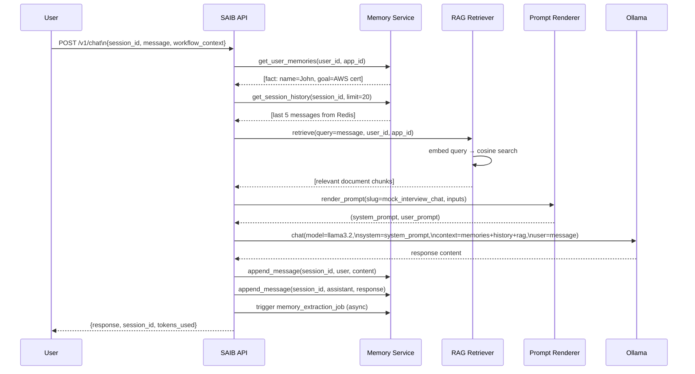
